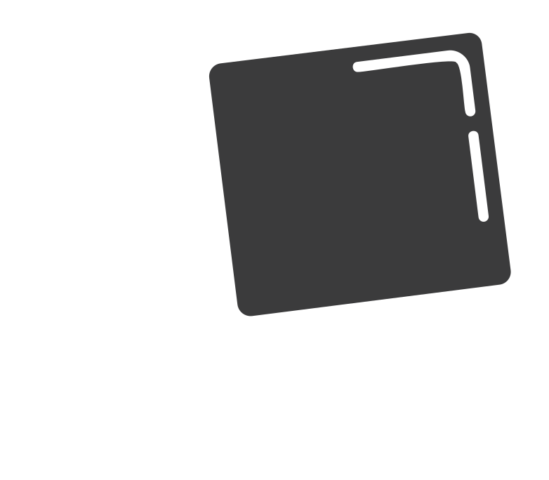

<!-- PROJECT LOGO -->
 

  

  <h3 align="center">Transisitors to Tetris</h3>

  

    A Physical Implementation of the Nand2Tetris  project but entirely from Transistors
     
   <a href="https://stephenkitomary.github.io/transistors2tetris/" target="_blank"><strong>Visit the Website »</strong></a>

  

<!-- TABLE OF CONTENTS -->

  
Table of Contents

  <ol>
    <li>
      <a href="#about-the-project">About The Project</a>
      <ul>
        <li><a href="#built-with">Built With</a></li>
      </ul>
    </li>
    <li>
      <a href="#getting-started">Getting Started</a>
      <ul>
        <li><a href="#prerequisites">Prerequisites</a></li>
        <li><a href="#installation">Installation</a></li>
      </ul>
    </li>
    <li><a href="#usage">Usage</a></li>
    <li><a href="#roadmap">Roadmap</a></li>
    <li><a href="#contributing">Contributing</a></li>
    <li><a href="#license">License</a></li>
    <li><a href="#contact">Contact</a></li>
    <li><a href="#acknowledgments">Acknowledgments</a></li>
  </ol>

<!-- ABOUT THE PROJECT -->
## About The Project

[![Product Name Screen Shot][product-screenshot]](https://example.com)

At some point, you might have asked yourself, "What makes up the computers we use nowadays?" When we break down a computer into its fundamental components, we eventually arrive at microchips, which themselves are composed of even smaller elements known as transistors. Transistors are the basic building blocks of all modern computer chips. They function as tiny switches that can turn on and off, representing the binary states of 1s and 0s that underpin all digital computing. Understanding how these transistors work and how they combine to form complex circuits is crucial for grasping the essence of computer hardware. This project, titled "Transistors to Tetris," takes this exploration to the next level by building a complete ALU (Arithmetic Logic Unit) from individual transistors, demonstrating the intricate processes that lead from simple electrical components to sophisticated computing systems capable of running complex software, like the Tetris game.

(<a href="#readme-top">back to top</a>)

### PROJECT BREAKDOWN

A computer is a complex machine made up of various interconnected sections, each playing a critical role in the overall functionality. These sections communicate with each other to perform the tasks we rely on in our daily computing. This project, "Transistors to Tetris," follows the logical progression of the "Nand to Tetris" course, detailing the construction and integration of each essential component of a computer. Below is a breakdown of the key sections:

* <b>NAND Gate: </b>The fundamental building block. All other gates (AND, OR, NOT, XOR) are derived from NAND gates.
* Other Gates: AND, OR, NOT, XOR, and their combinations to form more complex gates.
* <b>Half Adder and Full Adder:</b> Basic circuits for binary addition.
* <b>ALU (Arithmetic Logic Unit):</b> The central component for performing arithmetic and logical operations.
* <b>Flip-Flops and Latches:</b> Basic memory elements that store binary information.
* <b>Registers and Counters:</b> For storing and manipulating data within the CPU.
* <b>RAM (Random Access Memory):</b> A structured collection of registers to store data for quick access.
* <b>ROM (Read-Only Memory):</b> Stores the computer's boot-up instructions and other permanent data.

(<a href="#readme-top">back to top</a>)

<!-- LICENSE -->
## License

Distributed under the MIT License. See `LICENSE.txt` for more information.

(<a href="#readme-top">back to top</a>)

<!-- CONTACT -->
## Contact

Stephen Kitomary - - kitomarystephen@gmail.com

Project Link: [https://github.com/StephenKitomary/transistors2tetris](https://github.com/your_username/repo_name)

(<a href="#readme-top">back to top</a>)

<!-- ACKNOWLEDGMENTS -->
## Acknowledgments

This project would not have been possible without referring to the following invaluable resources:
* <b>Nand2Tetris Course and Book: </b> [(Website)](https://www.nand2tetris.org/) "The Elements of Computing Systems: Building a Modern Computer from First Principles" by Noam Nisan and Shimon Schocken. This comprehensive guide provided the foundational knowledge and structured approach necessary for constructing each component of the computer.

(<a href="#readme-top">back to top</a>)

<!-- MARKDOWN LINKS & IMAGES -->
<!-- https://www.markdownguide.org/basic-syntax/#reference-style-links -->
[contributors-shield]: https://img.shields.io/github/contributors/othneildrew/Best-README-Template.svg?style=for-the-badge
[contributors-url]: https://github.com/othneildrew/Best-README-Template/graphs/contributors
[forks-shield]: https://img.shields.io/github/forks/othneildrew/Best-README-Template.svg?style=for-the-badge
[forks-url]: https://github.com/othneildrew/Best-README-Template/network/members
[stars-shield]: https://img.shields.io/github/stars/othneildrew/Best-README-Template.svg?style=for-the-badge
[stars-url]: https://github.com/othneildrew/Best-README-Template/stargazers
[issues-shield]: https://img.shields.io/github/issues/othneildrew/Best-README-Template.svg?style=for-the-badge
[issues-url]: https://github.com/othneildrew/Best-README-Template/issues
[license-shield]: https://img.shields.io/github/license/othneildrew/Best-README-Template.svg?style=for-the-badge
[license-url]: https://github.com/othneildrew/Best-README-Template/blob/master/LICENSE.txt
[linkedin-shield]: https://img.shields.io/badge/-LinkedIn-black.svg?style=for-the-badge&logo=linkedin&colorB=555
[linkedin-url]: https://linkedin.com/in/othneildrew
[product-screenshot]: images/TRANSISTORS.jpg
[Next.js]: https://img.shields.io/badge/next.js-000000?style=for-the-badge&logo=nextdotjs&logoColor=white
[Next-url]: https://nextjs.org/
[React.js]: https://img.shields.io/badge/React-20232A?style=for-the-badge&logo=react&logoColor=61DAFB
[React-url]: https://reactjs.org/
[Vue.js]: https://img.shields.io/badge/Vue.js-35495E?style=for-the-badge&logo=vuedotjs&logoColor=4FC08D
[Vue-url]: https://vuejs.org/
[Angular.io]: https://img.shields.io/badge/Angular-DD0031?style=for-the-badge&logo=angular&logoColor=white
[Angular-url]: https://angular.io/
[Svelte.dev]: https://img.shields.io/badge/Svelte-4A4A55?style=for-the-badge&logo=svelte&logoColor=FF3E00
[Svelte-url]: https://svelte.dev/
[Laravel.com]: https://img.shields.io/badge/Laravel-FF2D20?style=for-the-badge&logo=laravel&logoColor=white
[Laravel-url]: https://laravel.com
[Bootstrap.com]: https://img.shields.io/badge/Bootstrap-563D7C?style=for-the-badge&logo=bootstrap&logoColor=white
[Bootstrap-url]: https://getbootstrap.com
[JQuery.com]: https://img.shields.io/badge/jQuery-0769AD?style=for-the-badge&logo=jquery&logoColor=white
[JQuery-url]: https://jquery.com 
